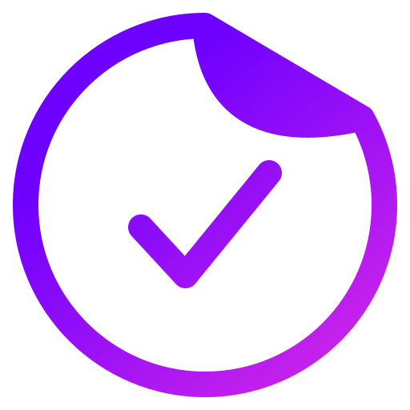

<div align="center">
  
  <h2>TickityTick</h2>
  <p>Stay Focused and Capture Tasks On-the-Go</p>
</div>

<div align="center">

  <!-- RUBY -->
  

  <!-- RAILS -->
  

  <!-- SQLite -->
  

  <!-- TailwindCSS -->
  

 <!-- MORE BADGES visit https://github.com/Ileriayo/markdown-badges -->

</div>

## Motivation

Do you ever get an important task idea while you're busy working, but reaching for your phone to add it feels disruptive?

TickityTick is a web app designed to help you stay focused and capture those fleeting ideas with minimal effort.

### Here's how it works

- ⭐ Accessible directly in your browser, eliminating the need to switch to your phone.
- ⭐ Simple and easy-to-use interface minimizes disruption to your workflow.
- ⭐ Perfect for capturing quick reminders or task ideas that pop into your head.
- ⭐ Responsive design ensures a smooth experience on both desktop and mobile devices.

## Production

This application is hosted in the production. You can check it out here: [TickityTick](https://tickity-tick.fly.dev/tasks)

## Development Setup

Open your terminal and clone this repo into a directory of your choice:

```
git clone git@github.com:JuzerShakir/tickity_tick.git
```

Opening the cloned repository

```
cd tickity_tick
code .
```

> Note: Before moving forward make sure **you have Ruby 3.3.1 version installed** in your system. [Or Download from here](https://gorails.com/setup)

Install all the dependencies

```
bundle install
```

### Create database and tables

```
rails db:migrate
```

### Setting up an Email

In order to test emails in development environment you need to install `mailcatcher` gem first.

```
gem install mailcatcher
```

Now to run the mailcatcher:

```
mailcatcher
```

This will output couple of URLs where it will listen for emails. You can visit anyone of the links to check if the emails.

---

<br>

<div align="center">
  <!-- BUY ME COFFEE -->
  <a href="https://www.buymeacoffee.com/juzershakir"> </a>
</div>

## Contributing

If you have problems, please create a [GitHub Issue](https://github.com/JuzerShakir/tickity_tick/issues).

Take a look at the [Contributing](CONTRIBUTING.md) document for
instructions on setting up the repo on your machine, understanding the codebase,
and creating a good pull request.

Thank you, contributors!

## Versioning

TickityTick follows Semantic Versioning 2.0 as defined at https://semver.org.

## License

This code is free to use under the terms of the MIT license.
